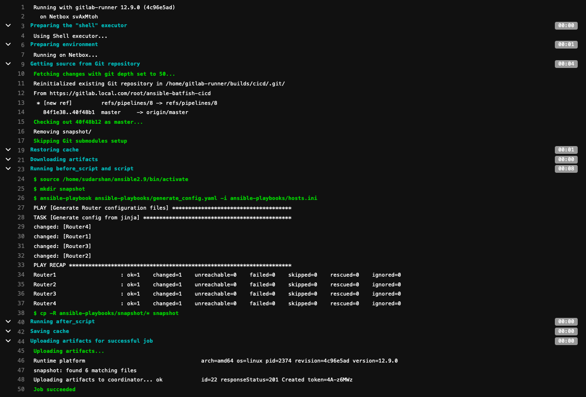
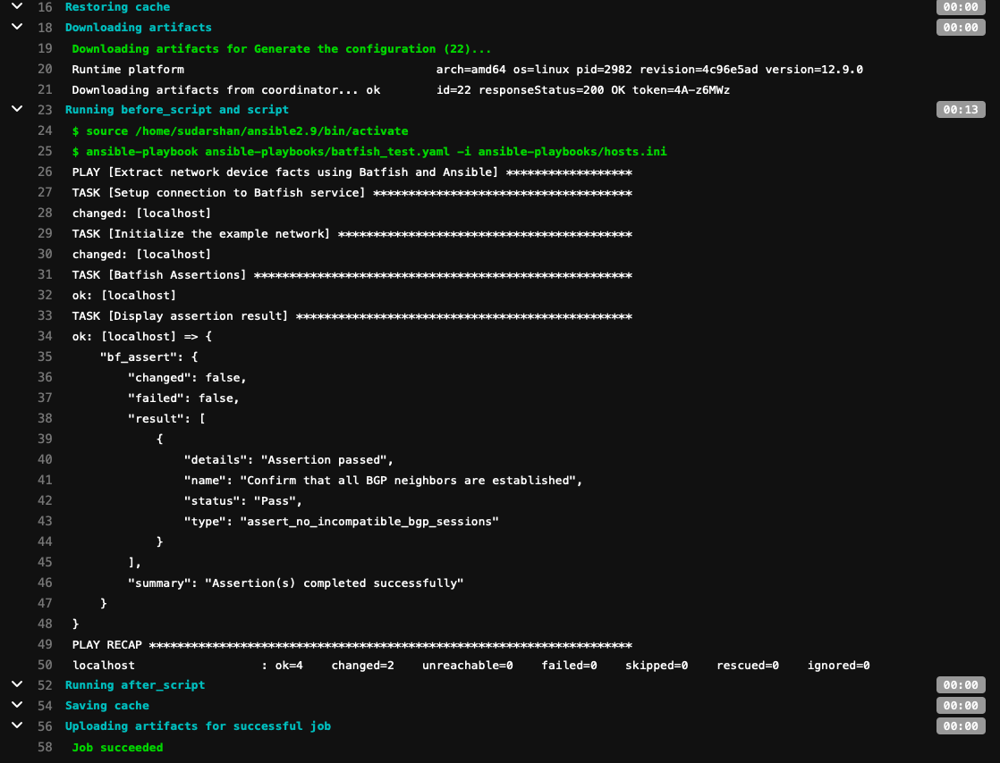
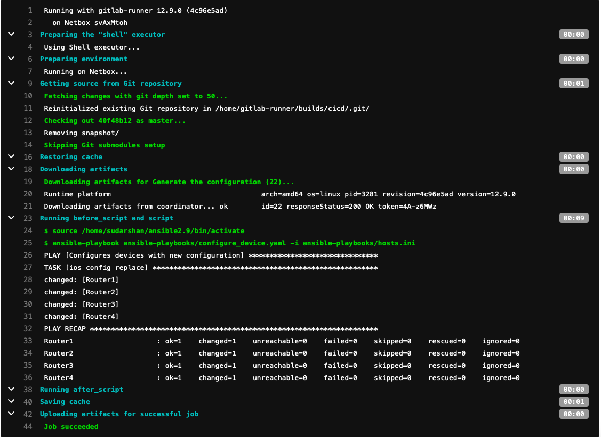

# CICD pipeline to configure BGP between four cisco IOS devices

This pipeline executes on a Self Managend GitLab instance and a gitlab-runner executing in shell mode.

# CICD workflow

Before making any configuration changes (only IP and BGP confgiuration covered in this example), a new issue and a branch needs to be created in GitLab.

Each time a commit is made to the Gitlab branch, device configs are generated and the generated configs are evaluated against defined policies.
    * The device configs are generated using jinja2 templates in the `templates` folder and input data in the `host_vars` folder. The code for configuration generation is in the `generate_config.yaml` playbook.
    * A batfish snapshot is initialized from the generated configuration and an assertion is made to validate that there are no incompatabile bgp sessions. The code to do this is in the `batfish_test.yaml` playbook.

Once these two stages are successful, a merge request needs to be placed to merge with the master branch. Upon approval, the third and final stage of the pipeline is initiated which configured the actual network devices. The code to do this is in the `configure_devices.yaml`.

The exact sequence of commands to generate configs and run assertions are in template.gitlab-ci.yml file, which is uploaded to the Gitlab repository as its pipeline file (.gitlab-ci.yml) when the repository is initialized.

# Sample Output

## Generate Configuration

## Batfish Test

## Configure Device

### Note
In a real world scenario I would use `napalm_install_config` to do a full config replace.
Do the limitation of using virtual Cisco IOS devices in EVE-NG and a lack of `flash:` memory on them, in the above example I have used `ios_config`.